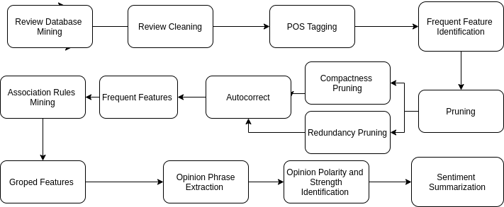

# Review_Analysis
As e-commerce and these online services are becoming more and more popular, the number of customer reviews that a product receives grows
rapidly which gives rise to the need to automating the process of reading the reviews and drawing meaningful summaries from the reviews which would help not only the customers to make decisions on whether to buy the product but also to the manufacturer to know exactly what all things need to be improved in the existing product and which ones to prioritize.
  
In this project, we implemented and extended some of the existing works on feature extraction and sentiment analysis for better and more informative summarizing. We firstly extract the one word features from a set of reviews based on their frequency of occurrence followed by association rules mining to get a list of two of word features by examining the words that occur frequently. This is followed by sentiment analysis of each and every feature to get an overall sentiment of a particular feature. We do not summarize the reviews by selecting or rewriting a subset of the original sentences from the reviews to capture their main points as in the classic text summarization. In this work, we only focus on mining opinion/product features that the reviewers have commented on.

## Approach
Figure 1 gives the architectural overview of our opinion extraction system. The
inputs to the system are the product reviews of all the customers. The output is
the summary of the reviews. The system involves three main steps: (1) Review
Cleaning; (2) Mining the frequent product features that have been commented on
by the customers; (3) Identify the customer opinions and the opinion intensities for
each product feature. A detailed project report can be found [here](Project_Report.pdf).  

  

## Conclusion
In this project, we propose a pipeline to extract meaningful features from the
customer reviews and get a sentiment score for each feature which is a measure of
positive polarity towards that feature. To achieve this objective, we divide our
pipeline into three major sections - cleaning, feature extraction and opinion
mining. Cleaning the dataset involves cleaning the reviews and removing all
useless data. Feature extraction pipeline generates a list of meaningful features.
Finally, opinions towards features are extracted and sentiment scores are assigned
to each feature in the opinion mining pipiline. We have evaluated this method on a
review dataset of smartphone of a popular brand and the results were meaningful.
